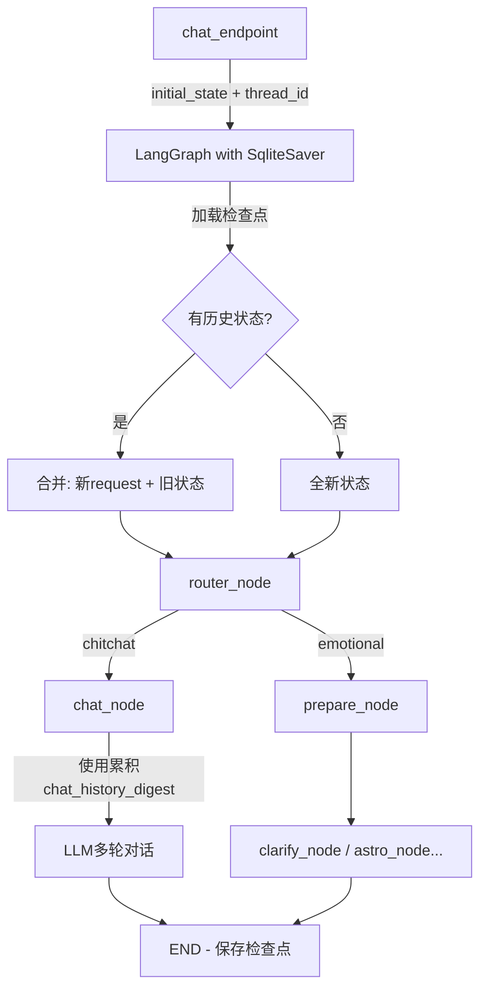

## 用户需求

修复影子AI对话记忆功能缺失问题，具体表现：

1. **对话没有记忆**：用户问"上面我和你聊了啥？"AI回答完全不相关
2. **选择回答后忘记说了啥**：在A/B选择场景中，AI忘记上下文

## 产品概述

影子AI是一个情感陪伴对话系统，基于LangGraph构建对话流水线，支持闲聊直答和深度情感分析两条路径。当前核心问题是多轮对话状态不持久，导致AI无法记住之前的聊天内容。

## 核心功能

- 持久化LangGraph检查点，使多轮对话状态跨请求保持
- 增强聊天历史在所有节点的传递和利用
- 优化chitchat系统提示词的记忆指令
- 添加必要的依赖（langgraph-checkpoint-sqlite）

## Tech Stack

- 后端：Python + FastAPI + LangGraph + LangChain
- LLM：DeepSeek (ChatOpenAI)
- 检查点存储：SqliteSaver（文件级持久化）
- 前端：uni-app 微信小程序

## Implementation Approach

**根本原因分析**：

1. `MemorySaver` 是纯内存存储，服务重启或不同请求间无法持久化检查点 → `graph.py` 第113-114行（已部分修改为SqliteSaver，但缺少依赖）
2. 每次 `ainvoke` 传 `initial_state={"request": body}`，LangGraph检查点机制会合并状态，但 `request` 字段的替换导致旧的 `chat_history` 被新请求覆盖
3. chitchat 系统提示词已有记忆规则（prompts.py 第171-176行），但前端传的 `chat_history` 依赖本地 `messageList`，如果前端刷新页面则丢失
4. LangGraph检查点恢复后，之前节点产出的 `reply`、`clarification` 等字段会被保留，但 `request` 字段被替换为新请求，导致 `_format_chat_history_digest(req)` 只能看到当前请求的 chat_history

**修复策略**：

- **检查点持久化**：将 `MemorySaver` 替换为 `SqliteSaver`，在 `requirements.txt` 添加 `langgraph-checkpoint-sqlite` 依赖
- **AgentState 增加独立历史字段**：添加 `chat_history_digest` 字段，在 router_node 中累积历史摘要，避免完全依赖 request.chat_history
- **优化检查点合并逻辑**：在 chat_endpoint 中，从检查点恢复的状态提取之前的 reply，追加到 chat_history 中传给下一轮，确保历史对话完整
- **SqliteSaver 连接管理**：使用上下文管理器或持久连接，确保 SqliteSaver 在异步环境中正确工作

**性能考量**：

- SqliteSaver 的 SQLite 文件 I/O 是微秒级，不会成为瓶颈
- 检查点状态序列化/反序列化开销极小
- chat_history_digest 累积机制需要控制总长度，避免超出 LLM 上下文窗口

## Implementation Notes

- `langgraph-checkpoint-sqlite` 的 `SqliteSaver` 需要显式安装，当前 requirements.txt 缺失
- `SqliteSaver` 需要一个 SQLite 连接，推荐使用 `from sqlalchemy import create_engine` 或直接 `sqlite3.connect`
- 检查点默认 reducer 是 replace，AgentState 的 `request` 字段每次 ainvoke 会被新值替换，需要通过累积 chat_history_digest 来保留历史
- SqliteSaver 在 LangGraph >= 0.2 中使用方式：`SqliteSaver.from_conn_string(db_path)` 或传入 connection
- 注意 SqliteSaver 的线程安全性，FastAPI 是异步的，需确保连接不跨线程共享

## Architecture Design



## Directory Structure

```
shadow_server/
├── app/
│   ├── config.py           # [MODIFY] 已添加 CHECKPOINT_DB_PATH 配置
│   ├── graph.py             # [MODIFY] 已将 MemorySaver 改为 SqliteSaver，需修复连接方式
│   ├── models.py            # [MODIFY] AgentState 增加 chat_history_digest 字段
│   ├── nodes.py             # [MODIFY] router_node 增加历史摘要累积逻辑
│   ├── routers/chat.py      # [MODIFY] chat_endpoint 增加检查点状态合并逻辑
│   ├── prompts.py           # [MODIFY] 无需修改（已有完善的记忆规则）
│   ├── main.py              # [MODIFY] lifespan 中关闭 SqliteSaver 连接
│   └── ...
├── requirements.txt         # [MODIFY] 添加 langgraph-checkpoint-sqlite 依赖
└── checkpoints/             # [NEW] 检查点数据库目录（自动创建）
```