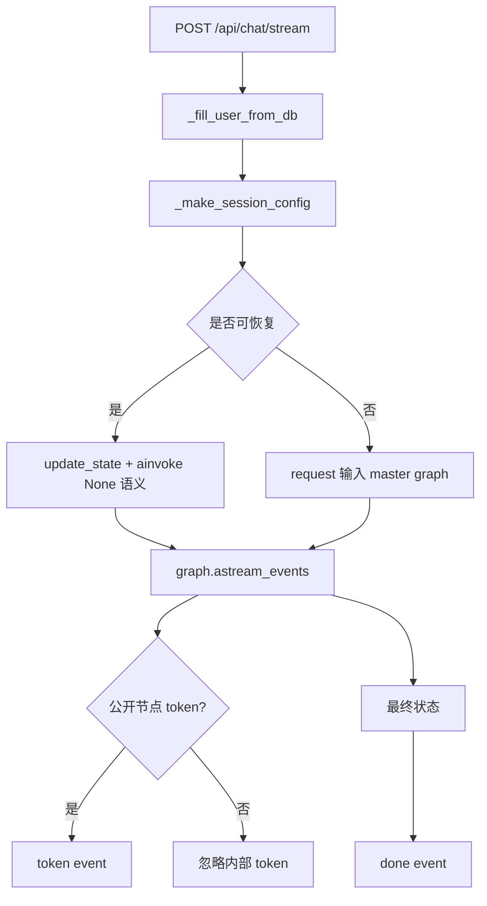

## 用户需求

继续完成既有计划文件中的第 6 项，即完善影子对话的独立实时流式输出能力。前 5 项已完成，本次只处理剩余流式端点相关工作，不扩大到其他重构内容。

## 产品概述

影子对话需要在保留现有普通接口的同时，提供一个独立的实时输出入口，让前端可以在同一会话中逐步展示用户可见回复，并在结束时获得完整会话结果。

## 核心功能

- 保留现有普通对话接口行为不变，确保旧客户端继续可用。
- 完善独立实时对话入口，支持返回会话建立、回复片段、完成、错误等事件。
- 所有分支复用同一套用户资料补全、会话标识和恢复逻辑，避免普通接口与实时接口行为不一致。
- 实时输出只暴露用户应看到的内容，避免把内部分析草稿、打磨过程、隐藏推理或中间节点内容推给前端。
- 完成事件需要包含稳定的 `session_id`、当前阶段、最终回复或追问内容，方便前端落库和继续多轮会话。

## Tech Stack Selection

- 后端框架：沿用当前 `shadow_server` 的 Python + FastAPI。
- 工作流：沿用当前 LangGraph `build_master_graph()`、`thread_id/session_id` 与 checkpointer 机制。
- 流式响应：沿用 `StreamingResponse` 与当前 `graph.astream_events(..., version="v2")` 实现方向。
- LLM 与节点：不新增模型或节点，复用现有 `router_node`、`generate_node`、`specialist_node`、`clarify_node`、`combine_node` 等已注册节点。
- 测试入口：优先通过现有 `/api/chat`、`/api/chat/stream` 和 `shadow_server/static/test_panel.html` 做端到端验证。

## Implementation Approach

本次采用小范围加固策略：保留已经存在的 `/api/chat/stream`，重点修复“所有模型 token 都被转发”的风险，并使流式接口的最终结果与 `/api/chat` 保持一致。核心做法是在 `chat.py` 中抽取流式事件过滤与最终状态归一化逻辑，只允许用户可见节点的输出进入前端流，同时继续复用现有用户资料补全、session 配置和恢复逻辑。

关键技术决策：

1. **不重写 master graph**

- 当前 `main.py` 已使用 `build_master_graph()`，`graph.py` 也已注册统一路由与三条分支。
- 第 6 项只需完善流式端点，不应改动图结构或节点编排，避免影响前 5 项已完成内容。

2. **按节点过滤流式 token**

- 当前风险是只按 `on_chat_model_stream` 过滤，可能泄露 `draft_node/refine_node/analyze_node/search_node/astro_insight_node` 的内部 token。
- 计划只允许公开节点输出：`generate_node`、`specialist_node`、`clarify_node`、`combine_node`。
- 对情绪深度分支，内部草稿与打磨仍只保存在 `internal_notes`，最终只通过 `combine_node` 或完成事件暴露。

3. **完成事件作为权威结果**

- 流式 token 只用于实时展示，最终 `done` 事件应返回与普通接口一致的 `phase`、`reply`、`clarification`、`session_id` 和必要调试信息。
- 如果某些分支没有可安全转发的 token，前端仍可依赖 `done` 事件拿到完整结果。

4. **错误事件结构化**

- 上游超时、模型错误、图执行异常均转成 `error` 事件。
- 不在 SSE 中输出 API Key、完整用户隐私资料、隐藏 prompt 或大段内部状态。

5. **性能与可靠性**

- 事件过滤是单次事件的常数级判断，复杂度 O(n)，n 为图执行产生的事件数量。
- 不额外触发第二次图执行，不重复调用 LLM，避免延迟和费用翻倍。
- 保持已有 `/api/chat` JSON 接口不变，降低兼容风险。

## Implementation Notes

- 修改重点为 `/Users/xl/Desktop/xinyu_v1/shadow_server/app/routers/chat.py`。
- 必须复用现有 `_fill_user_from_db()`、`_make_session_config()`、`_try_prepare_resume()` 或 `_invoke_graph()` 的语义。
- SSE 响应建议补充 `Cache-Control: no-cache`、`Connection: keep-alive`、`X-Accel-Buffering: no` 等头，减少代理缓冲。
- 事件名继续保持 `session`、`token`、`done`、`error`，避免破坏已接入前端。
- 日志沿用现有 `logger.info("[chat_stream] ...")` 风格，不记录完整请求体和隐私资料。
- 不修改 `.codebuddy` 目录，不进行无关重构。

## Architecture Design

流式接口完成后，调用链保持为：



## Directory Structure

```text
/Users/xl/Desktop/xinyu_v1/
└── shadow_server/
    ├── app/
    │   └── routers/
    │       └── chat.py
    │           # [MODIFY] 完善 /api/chat/stream。
    │           # 负责 SSE 事件格式、公开节点 token 过滤、最终 done payload 归一化、
    │           # 错误事件处理、响应头设置，并确保与 /api/chat 复用相同用户补全、
    │           # session_id/thread_id 和恢复逻辑。
    └── static/
        └── test_panel.html
            # [MODIFY] 可选但建议同步增加流式测试按钮或输出区域。
            # 用于手动验证 session/token/done/error 事件顺序，
            # 覆盖普通问答、联网问答、专项分析和情绪深度追问/恢复场景。
```

## Key Code Structures

无需新增复杂数据结构。实现时建议在 `chat.py` 内部保持私有辅助函数级别，例如：

- 公开节点白名单：用于判断哪些 `langgraph_node` 的 token 可以转发。
- SSE 序列化函数：统一输出 `event: ...` 与 `data: ...`。
- 最终结果归一化函数：从图最终状态提取 `phase/reply/clarification/debug_info/session_id`。

## Agent Extensions

### SubAgent

- **code-explorer**
- Purpose: 在实施前复核 `chat.py` 中当前 `/api/chat/stream` 事件结构、LangGraph event metadata 字段、普通 `/api/chat` 返回结构和测试面板调用方式。
- Expected outcome: 明确可安全过滤的节点名、最终状态提取方式和最小修改范围，避免破坏前 5 项已完成逻辑。